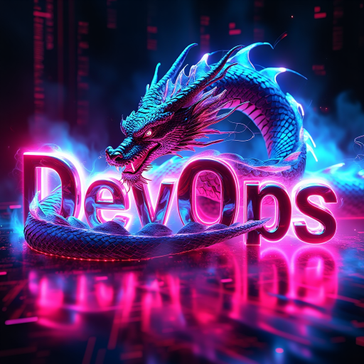
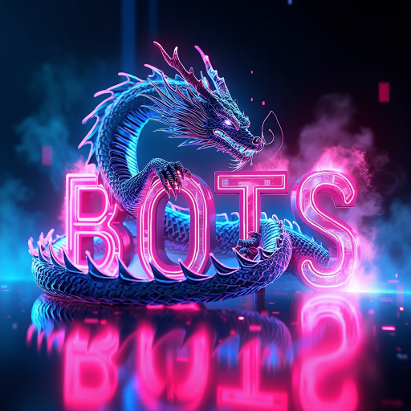
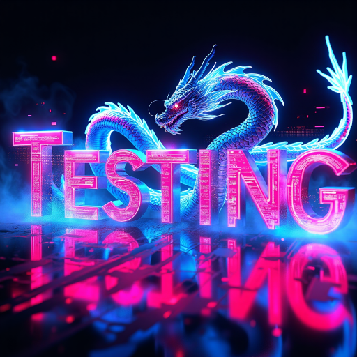
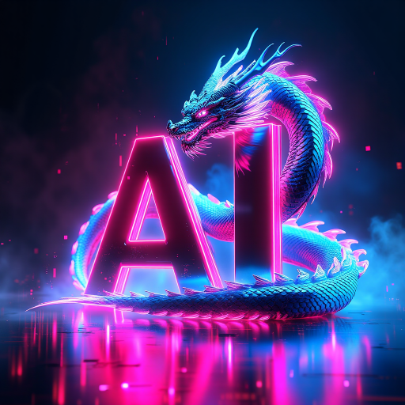

<!-- ============[HEADER]============ -->

  <!-- Header-Banner -->
  

   

  <!-- Name SVG als Banner darunter -->
  

  <!-- Icons für LinkedIn und Xing darunter zentrieren -->
  

    
    &nbsp;&nbsp; <!-- Abstand zwischen den Icons -->
    
  

  

<!-- ============[DIVIDER]============ -->

<!-- ============[DIVIDER]============ -->

<!-- ============[SUPPORT]============ -->
<table align="center">
  <tr>
    <td align="left" width="40%">
        
         
        ➤ <i>Work Time</i> <i>24/7</b> 🕜 
        ➤ <b>FREE LIFETIME Support</b> 💭
           
        
        ➤ <i>Professional Software</i> 🤖 
        ➤ <b>10 years</b> of experience ☕ 
        ➤ <i>Windows, MAC & Linux</i> 💻 
        ➤ <i><b>Best price</b> for complex Projects</i> 💲
         
         &nbsp;&nbsp;&nbsp;&nbsp;&nbsp;&nbsp;&nbsp;&nbsp;&nbsp;&nbsp;&nbsp;&nbsp;&nbsp;&nbsp;&nbsp;&nbsp;&nbsp;&nbsp;&nbsp;&nbsp;&nbsp;&nbsp;&nbsp;&nbsp;&nbsp;
        &nbsp;&nbsp;&nbsp;&nbsp;&nbsp;&nbsp;&nbsp;&nbsp;&nbsp;&nbsp;&nbsp;&nbsp;&nbsp;&nbsp;&nbsp;&nbsp;&nbsp;&nbsp;&nbsp;&nbsp;&nbsp;&nbsp;&nbsp;&nbsp;&nbsp;
    </td>
    <td align="right" width="60%">
      
    </td>
  </tr>
</table>

  
---
  

<!-- ============[SKILLS HEADER]============ -->

<!-- ============[SOFT SKILLS]============ -->
  
<table align="center">
  <tr>
    <td align="left" width="40%">
    
     
      
    </td>
    <td align="left" width="40%">
      

        
        ➤ <i>Analytical Thinking, Creative Solutions, Root Cause Analysis, Strategic Approach to Complex Challenges</i>
          
        
        ➤ <i>Effective Team Collaboration, Clear and Concise Documentation, Stakeholder Engagement, Cross-functional Coordination</i>
          
        
        ➤ <i>Prioritization of Tasks, Meeting Deadlines, Efficient Multitasking, Optimizing Workflows for Maximum Productivity</i>
          
        
        ➤ <i>Learning New Technologies Quickly, Thriving in Fast-paced Environments, Flexible in Adjusting to New Situations, Handling Change with Confidence</i>
          
        
        ➤ <i>Guiding Teams to Success, Mentoring and Supporting Colleagues, Influencing Outcomes through Positive Leadership, Taking Initiative in Uncertain Situations</i>
          
        
        ➤ <i>Data-driven Decision Making, Evaluating Risk and Opportunities, Constructive Feedback Integration, Sound Judgement under Pressure</i>
          
        
        ➤ <i>Precise Coding Practices, Thorough Code Reviews, Identifying and Mitigating Potential Issues Early in Development</i>
          
        
        ➤ <i>Understanding Team Dynamics, Managing Stress Effectively, Empathy in Professional Interactions, Building Trust within the Team</i>
          
        
        ➤ <i>Constantly Seeking Improvement, Embracing New Ideas, Implementing Cutting-edge Solutions to Stay Ahead of Trends</i>
      

    </td>
  </tr>
</table>

  
<!-- ============[DIVIDER]============ -->

<!-- ============[DIVIDER]============ -->
  

<!-- ============[PROJECT MANAGMENT]============ -->
<table align="center">
  <tr>
    <td align="left" width="40%">
      

        
        ➤ <i>Task Management, Bug Tracking, Agile Boards</i>
           
        
        ➤ <i>Agile Development Methodology, Sprint Planning, Daily Standups</i>
      

    </td>
    <td align="right" width="40%">
      
    </td>
  </tr>
</table>

   
<!-- ============[DIVIDER]============ -->

<!-- ============[DIVIDER]============ -->
   

<!-- ============[PROGRAMMING LANGUAGES]============ -->
<table align="center">
  <tr>
    <td align="left" width="60%">
      
    </td>
    <td align="left" width="40%">
      

        
        ➤ <b>Versions:</b><i> ES2016 - ES2024, CJS, ESM</i>
         
        ➤ <b>Frameworks/Libraries:</b><i> React, Next.js</i>
          
        
        ➤ <b>Frameworks:</b><i> Express, Next.js</i>
          
        
        
        
        
        
      

    </td>
  </tr>
</table>

   
<!-- ============[DIVIDER]============ -->

<!-- ============[DIVIDER]============ -->
   

<!-- ============[BACKEND DEVELOPMENT]============ -->
<table align="center">
  <tr>
    <td align="left" width="40%">
      

        
        ➤ <b>API Design:</b><i> CRUD, Middlewares, Route Handling, Status Codes, Versioning</i>
         
        ➤ <b>Security:</b><i> JWT, OAuth2, Rate Limiting, CORS</i>
         
        ➤ <b>Tools:</b><i> Postman</i>
          
        
        ➤ <b>Dependencies:</b><i> express-restify-mongoose</i>
          
        
        
         
         
        
         
        
         
        
      

    </td>
    <td align="right" width="60%">
      
    </td>
  </tr>
</table>

   
<!-- ============[DIVIDER]============ -->

<!-- ============[DIVIDER]============ -->
   

<!-- ============[FRONTEND DEVELOPMENT]============ -->
<table align="center" width="100%">
  <tr>
    <td align="left" width="60%">
      
    </td>
    <td align="left" width="40%">
      

        
        
        
        
        &nbsp;&nbsp;&nbsp;&nbsp;&nbsp;&nbsp;&nbsp;&nbsp;&nbsp;&nbsp;&nbsp;&nbsp;&nbsp;&nbsp;&nbsp;&nbsp;&nbsp;&nbsp;&nbsp;&nbsp;&nbsp;&nbsp;&nbsp;&nbsp;&nbsp;
        &nbsp;&nbsp;&nbsp;&nbsp;&nbsp;&nbsp;&nbsp;&nbsp;&nbsp;&nbsp;&nbsp;&nbsp;&nbsp;&nbsp;&nbsp;&nbsp;&nbsp;&nbsp;&nbsp;&nbsp;&nbsp;&nbsp;&nbsp;&nbsp;&nbsp;
      

    </td>
  </tr>
</table>

   
<!-- ============[DIVIDER]============ -->

<!-- ============[DIVIDER]============ -->
   

<!-- ============[DEVOPS DEVELOPMENT]============ -->
<table align="center">
  <tr>
    <td align="left" width="40%">
      

        
        ➤ <b>Hosts:</b><i> Digital Ocean, Google Cloud</i>
         
        ➤ <b>Tasks:</b><i> SSH Access, Server Configuration, Scripts, Domains</i>
          
        
        ➤ <b>Tools:</b><i> Docker Compose</i>
          
        
        ➤ <b>Tools:</b><i> Minikube, k9s, Helm, kubectl</i>
          
        
        ➤ <b>Techniques:</b><i> IP Masking, Bypassing Detections, Network Tunneling</i>
         
        ➤ <b>Tools:</b><i> OpenVPN, NordVPN</i>
          
        
        ➤ <b>Usage:</b><i> Disk Encryption, Hidden Volumes, Keyfiles, Encryption Algorithms</i>
          
        
        
        
      

    </td>
    <td align="right" width="60%">
      
    </td>
  </tr>
</table>

   
<!-- ============[DIVIDER]============ -->

<!-- ============[DIVIDER]============ -->
   

<!-- ============[BOTS]============ -->
<table align="center">
  <tr>
    <td align="left" width="60%">
      
    </td>
    <td align="left" width="40%">
      

        
        ➤ <b>Languages:</b><i> Node.js, Bash</i>
         
        ➤ <b>Use Cases:</b><i> Discord Bots, Task Scheduling, Data Gathering, Notifications, ...</i>
          
        
         
        
         
        
      

    </td>
  </tr>
</table>

   
<!-- ============[DIVIDER]============ -->

<!-- ============[DIVIDER]============ -->
   

<!-- ============[TESTING]============ -->
<table align="center">
  <tr>
    <td align="left" width="40%">
      

        
        
        
        
        
        
        
                 &nbsp;&nbsp;&nbsp;&nbsp;&nbsp;&nbsp;&nbsp;&nbsp;&nbsp;&nbsp;&nbsp;&nbsp;&nbsp;&nbsp;&nbsp;&nbsp;&nbsp;&nbsp;&nbsp;&nbsp;&nbsp;&nbsp;&nbsp;&nbsp;&nbsp;
        &nbsp;&nbsp;&nbsp;&nbsp;&nbsp;&nbsp;&nbsp;&nbsp;&nbsp;&nbsp;&nbsp;&nbsp;&nbsp;&nbsp;&nbsp;&nbsp;&nbsp;&nbsp;&nbsp;&nbsp;&nbsp;&nbsp;&nbsp;&nbsp;&nbsp;
      

    </td>
    <td align="right" width="60%">
      
    </td>
  </tr>
</table>

   
<!-- ============[DIVIDER]============ -->

<!-- ============[DIVIDER]============ -->
   

<!-- ============[AI]============ -->
<table align="center">
  <tr>
    <td align="left" width="60%">
      
    </td>
    <td align="left" width="40%">
      

        
         
        ➤ <i>Crafting Effective Prompts for Text & Image Generation</i>
          
        
         
        ➤ <i>Text-to-* Models, AI Art Generation, Image Modification, Stable Diffusion, Flux, Fine Tuning...</i>
      

    </td>
  </tr>
</table>

  
---
 

I would welcome the opportunity for a personal interview.

